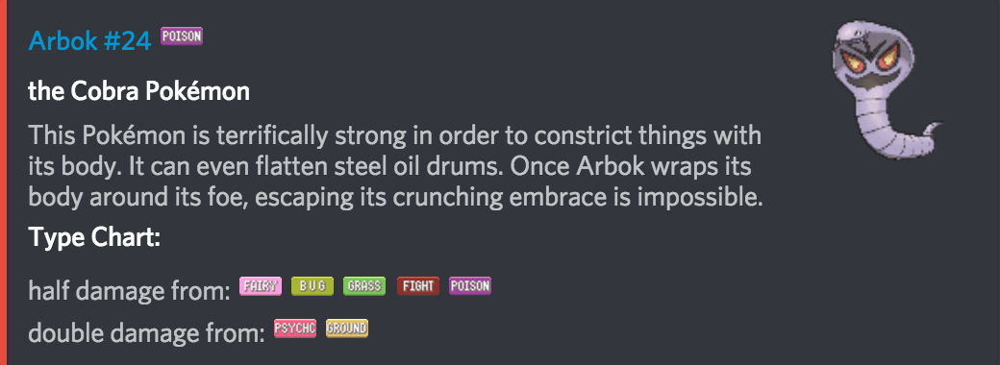

# arbot
> a Discord bot that serves Pokémon data and games to its users

Made with [discord.py](https://github.com/Rapptz/discord.py) and [PokeAPI](https://pokeapi.co/)

# Main features:
## Pokédex
> Arbot can provide information about any Pokémon using `>dex`

**Usage**: `>dex pkmn name / id`

Example: `>dex arbok` *or* `>dex 24`

Comes with custom emojis for types:

                  

<!--More Pokédex features coming soon!!
-->

## Who's that Pokémon
> Play the classic guessing game seen on the anime using `>wtp`. A Pokémon will be shrouded in darkness and it's up to you and your friends to compete for the correct one.

**Usage**: `>wtp (optional: gen id)`

Example: `>wtp` *or* `>wtp 1`

|    |    |
|:---:|:---:|

## Fuse Pokémon
> Combine two Pokémon together with the hilarious app made by Alex Onsager. Use `>fuse` to combine any two Generation 1 Pokémon.

**Usage** `>fuse [pkmn 1] [pkmn 2]`

Example: `>fuse arbok porygon` *or* `>fuse 24 137`

## Other commands
|  Twitch user Lookup  |  DuckDuckGo search  | YouTube Search |
|:---|:---|:---|
| `>tw [username]` | `>ddg [query]` | `>yt [query]` |

|  Python documentation  |  Discord.py documentation  |
|:---|:---|
| `>py [query]` | `>dpy [query]` |
